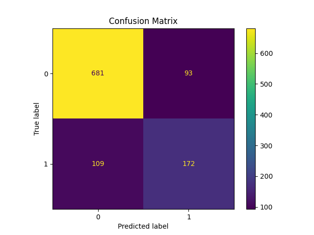
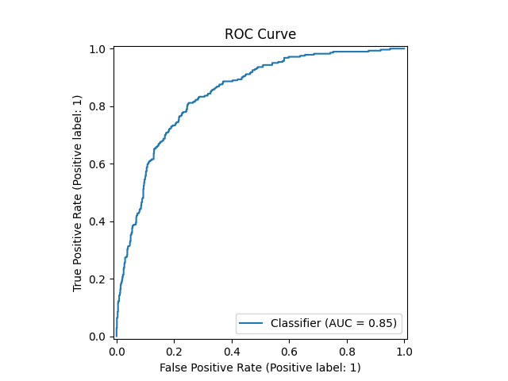
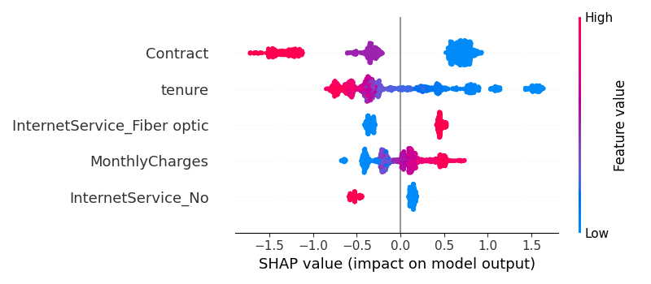

# Customer-Churn-Prediction

This notebook demonstrates a machine learning approach to predict customer churn in a telecommunications dataset.

## Model Used
- CatBoostClassifier
- Compared against:
  - Dummy Classifier
  - Logistic Regression
- Evaluated using accuracy, precision, recall, F1-score, and classification report.

## Dataset
- Source: [Telco Customer Churn dataset on Kaggle](https://www.kaggle.com/datasets/blastchar/telco-customer-churn)
- Class Distribution: 774 non-churn vs. 281 churn

## How to Run
1. Install required packages: `pip install -r requirements.txt`
2. Run `main.py` from the command line.

## Results
- Accuracy: ~80.9%
- Precision (Churn class): 65%
- Recall (Churn class): 61%
- F1-Score (Churn class): 63%
- AUC: ~0.85

## Visualizations
- **Confusion Matrix**: Highlights correct vs. incorrect predictions

- **ROC Curve**: AUC of 0.85 shows strong discriminative power

- **SHAP Summary Plot**: Shows that Contract type, Tenure, InternetService, and MonthlyCharges are key churn indicators.

## License
This project is licensed under the MIT License.
